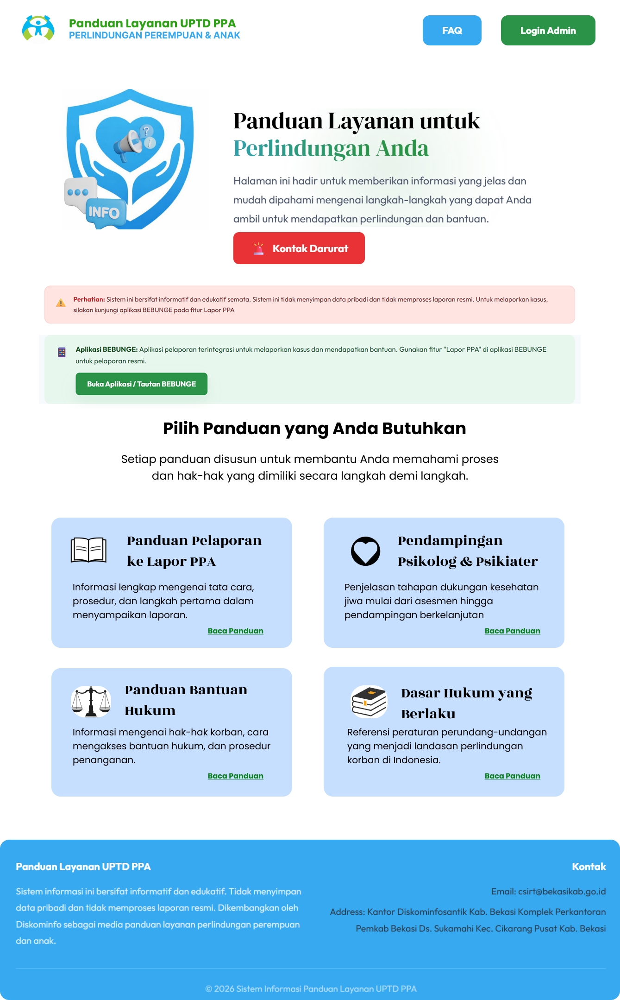

# IMPLEMENTASI SISTEM INFORMASI PANDUAN LAYANAN PPA BERBASIS WEB

## DENGAN INTEGRASI FITUR LAPOR PPA PADA APLIKASI BEBUNGE

### 1. Tampilan Beranda Pengguna

### 2. Tampilan Kontak Darurat

### 3. Tampilan Panduan Layanan Pelaporan

### 4. Tampilan Panduan Layanan Pendampingan Psikolog & Psikiater

### 5. Tampilan Panduan Layanan Bantuan Hukum

### 6. Tampilan Dasar Hukum

### 7. Tampilan FAQ

### 8. Tampilan Login Admin

### 9. Tampilan Dashboard Admin

### 10. Tampilan Kelola Panduan Layanan

### 11. Tampilan Kelola Dasar Hukum

### 12. Tampilan Kelola FAQ

### 13. Tampilan Kelola Kontak Darurat

 
## 1. Deskripsi Sistem

Sistem Informasi Panduan Layanan PPA berbasis web merupakan aplikasi yang dirancang untuk menyediakan informasi layanan secara terstruktur dan mudah diakses oleh masyarakat terkait layanan Perlindungan Perempuan dan Anak (PPA). Sistem ini juga terintegrasi dengan fitur **Lapor PPA** pada aplikasi Bebunge guna mendukung proses pelaporan yang lebih cepat, terarah, dan terdokumentasi secara digital.

Sistem dikembangkan untuk meningkatkan efektivitas penyampaian informasi layanan, transparansi prosedur, serta kemudahan akses bagi masyarakat yang membutuhkan pendampingan maupun pelaporan kasus.

---

## 2. Tujuan Pengembangan

Tujuan dari implementasi sistem ini adalah:

* Menyediakan panduan layanan PPA secara daring (online).
* Mempermudah masyarakat memahami alur dan prosedur layanan.
* Mendukung integrasi dengan fitur Lapor PPA pada aplikasi Bebunge.
* Meningkatkan efisiensi pengelolaan informasi oleh admin.
* Mendorong digitalisasi layanan publik berbasis web.

---

## 3. Fitur Utama Sistem

### A. Fitur Pengguna (User)

* Halaman Beranda
* Informasi Dasar Hukum
* Panduan Layanan
* FAQ (Frequently Asked Questions)
* Kontak Darurat
* Integrasi tombol/akses menuju fitur Lapor PPA pada aplikasi Bebunge

### B. Fitur Admin

* Login dan autentikasi
* Dashboard admin
* Manajemen konten panduan layanan
* Manajemen FAQ
* Manajemen informasi dasar hukum
* Pengelolaan data kontak darurat

---

## 4. Teknologi yang Digunakan

* Bahasa Pemrograman: PHP
* Database: MySQL
* Web Server: Apache (XAMPP)
* Frontend: HTML, CSS
* Version Control: Git & GitHub

---

## 5. Alur Implementasi Sistem

1. Analisis kebutuhan sistem berdasarkan kebutuhan layanan PPA.
2. Perancangan sistem menggunakan diagram UML (Use Case, Sequence, Deployment).
3. Implementasi sistem berbasis web menggunakan PHP dan MySQL.
4. Integrasi fitur Lapor PPA pada aplikasi Bebunge melalui tautan/akses langsung.
5. Pengujian sistem untuk memastikan fungsi berjalan sesuai kebutuhan.
6. Deployment dan dokumentasi sistem.

---

## 6. Integrasi dengan Aplikasi Bebunge

Sistem ini terintegrasi dengan fitur **Lapor PPA** pada aplikasi Bebunge sebagai media pelaporan digital. Integrasi dilakukan melalui penyediaan akses langsung dari halaman web menuju fitur pelaporan, sehingga masyarakat dapat dengan mudah melakukan pelaporan setelah memahami panduan layanan yang tersedia.

Integrasi ini bertujuan untuk:

* Mempercepat proses pelaporan
* Mengurangi hambatan administratif
* Mendukung pencatatan kasus secara sistematis

---

## 7. Manfaat Sistem

* Bagi Masyarakat:

  * Mendapatkan informasi layanan secara jelas dan terstruktur.
  * Memahami prosedur sebelum melakukan pelaporan.
  * Akses layanan lebih mudah dan cepat.

* Bagi Instansi:

  * Meningkatkan efisiensi pengelolaan informasi.
  * Mendukung digitalisasi pelayanan publik.
  * Meningkatkan transparansi dan akuntabilitas layanan.

---

## 8. Kesimpulan

Implementasi Sistem Informasi Panduan Layanan PPA berbasis web dengan integrasi fitur Lapor PPA pada aplikasi Bebunge merupakan langkah strategis dalam mendukung transformasi digital pelayanan publik. Sistem ini tidak hanya menyediakan informasi layanan secara informatif dan terstruktur, tetapi juga memperkuat mekanisme pelaporan digital yang terintegrasi dan efisien.

---

© 2026 Sistem Informasi Panduan Layanan PPA
